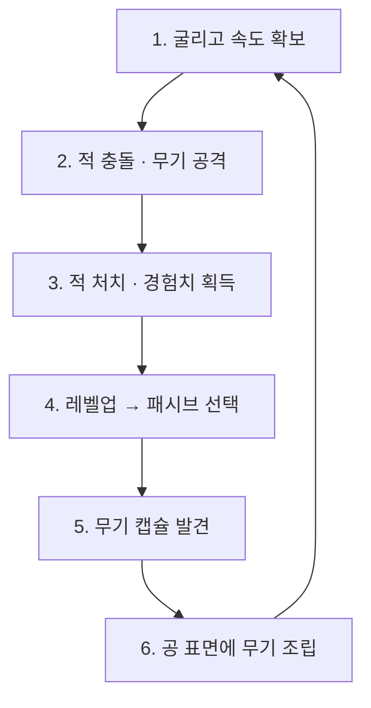

# CORE_LOOP — RUMBLE BALL

- Status: CONFIRMED (원본 기획서 2.2 기반)

## 루프 개요 (한 사이클: 수 초 ~ 수십 초)

## 단계별 상세

### 1. 지각 (Perceive) — 전장 읽기

| 항목 | 내용 |
|---|---|
| 플레이어가 보는 것 | 적 위치·종류(색으로 구분), 무기 캡슐, 경험치 오브, 자신의 현재 속도 단계(VFX), 부착 무기의 회전 방향 |
| 입력 | 마우스로 카메라 회전하며 전장 탐색 |
| 피드백 | 속도 단계별 VFX(먼지→궤적→발광→전기 아크), 위험 예고(색·바닥 표시·준비 동작 중 2가지 이상) |

### 2. 판단 (Choose) — 경로와 리스크 선택

플레이어가 매 순간 내리는 판단:

- **어느 방향으로 가속할 것인가** — 관성 때문에 즉시 방향 전환 불가. 경로를 미리 계획해야 한다.
- **돌파 vs 회피** — 속도가 높을수록 충돌 피해가 크지만, 적진 한가운데로 들어가는 위험도 커진다.
- **대시를 지금 쓸 것인가** — 대시는 공격 강화 수단이자 긴급 회피 수단. 쿨다운이 있어 이중 용도 사이에서 선택.
- **어떤 적부터 처리할 것인가** — 돌진형(비틀)은 경로를 끊고, 탱커(브루트)는 길을 막는다.
- **무기를 어디에 붙일 것인가** — 캡슐에 닿는 접촉 각도로 부착 슬롯이 결정된다(WPN-001 슬롯 스냅). 어느 방향으로 캡슐을 주울지가 곧 무기 배치 선택이다.
- **레벨업 시 어떤 패시브를 고를 것인가** — 안정형 / 고위험 돌파형 / 빠른 성장형.

### 3. 행동 (Act)

| 입력 | 동작 | 전투 의미 |
|---|---|---|
| WASD | 카메라 기준 이동 | 속도와 회전 방향 형성 |
| 마우스 | 카메라 회전 | 진행 방향·전장 탐색 |
| Space | 점프 | 장애물 회피, 낙하 충돌 |
| Left Shift | 대시 | 고속 충돌, 돌파, 긴급 회피 |
| ESC | 일시정지 | 메뉴 |

### 4. 결과 (Result)

- 충돌: 속도·정면도·대시 여부에 따라 피해와 넉백 (DMG-001)
- 무기: 회전 중 노출 각도·거리 조건이 맞으면 자동 발동 (SPK/CAN/TES 규칙)
- 적 처치 → 경험치 오브 → 흡수 → 레벨업 → 패시브 강화
- 무기 캡슐 획득 → 표면 조립 연출 → 실루엣 변화 → 공격 패턴 확장
- 피격 → HP 감소 → 0이면 패배

### 5. 다음 판단으로

성장(패시브·무기)이 플레이어의 다음 경로 선택을 바꾼다. 예: 스파이크 장착 후에는 정면 돌파가 유리해지고, 테슬라 장착 후에는 적 무리 근처 유지가 유리해진다.

## 한 판(런)의 시작과 끝

- Status: CONFIRMED
- 시작: 타이틀에서 Play 클릭 → 0:00 조작 즉시 시작, 0:05 안에 첫 적 노출. 별도 튜토리얼 스테이지 없음.
- 끝: HP 0 (패배) 또는 보스 처치 (승리) → 결과 화면 → 원클릭 재시작.
- 기준 길이는 3:30. 3:30에 보스가 살아 있으면 광폭화 상태로 결판까지 연장 (WIN-002).
- 세션 타임라인(무기 0:15 / 1:00 / 2:00, 보스 2:30 등)은 원본 기획서 4.1을 따른다.

## 반복 플레이 간 변화

- Status: CONFIRMED
- 원칙: "매 판 완성된 공의 모습이 조금씩 달라져야 한다."
- 변화 원천 3가지:
  1. 무기 획득 순서 — 3종이 매 판 랜덤 순서·중복 없이 등장 (WPN-005)
  2. 무기 부착 위치 — 캡슐 접촉 각도에 따른 슬롯 스냅 (WPN-001)
  3. 패시브 선택 — 안정형 / 돌파형 / 성장형 빌드 방향
