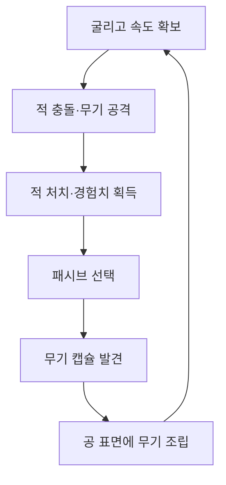
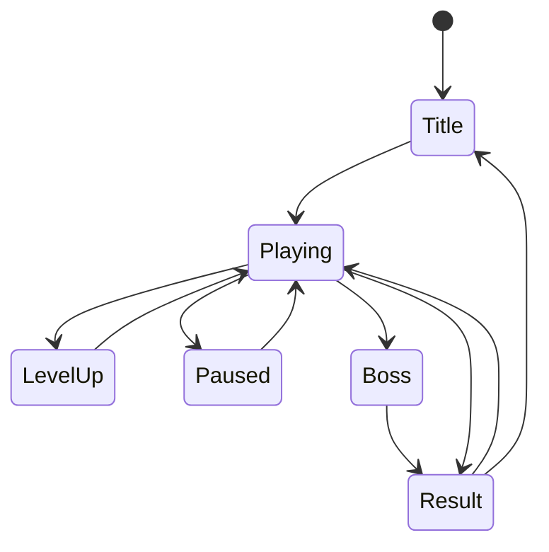

# RUMBLE BALL 종합 게임 기획서

> 구를수록 무기가 조립되고, 빨라질수록 강해지는 3D 물리 액션 로그라이트

| 항목 | 내용 |
|---|---|
| 문서 목적 | 해커톤 제출용 MVP 제작, 심사, 사옥 현장 시연까지 일관된 개발 기준 제공 |
| 장르 | 3D 물리 액션 + 아레나 서바이벌 + 로그라이트 |
| 플랫폼 | PC, PC Web, 최신 Chrome·Edge 권장 |
| 엔진 | Unity 6 계열, URP |
| 플레이 인원 | 1인 |
| 1회 플레이 | 3분 30초 ~ 10분|
| 핵심 입력 | WASD, 마우스, Space, Left Shift |
| MVP 범위 | 1맵, 플레이어 1종, 무기 3종, 패시브 3종, 일반 적 3종, 보스 1종 |
| 핵심 차별점 | 무기가 공 표면에 실제로 부착되며, 구체의 회전·속도·충돌 방향이 공격 결과를 바꿈 |

---

## 1. 프로젝트 목표

### 1.1 한 문장 소개

플레이어가 코어볼을 직접 굴려 무기를 표면에 장착하고, 회전하는 무기와 고속 충돌로 적 무리를 돌파하는 3D 물리 액션 로그라이트.

### 1.2 30초 피치

럼블볼은 공격 버튼 없이 이동, 회전, 충돌 자체가 공격이 되는 게임이다. 전장에서 획득한 무기는 공 표면의 접촉 위치에 실제로 조립되며, 공이 회전할 때 무기의 위치와 방향에 따라 공격 타이밍이 달라진다. 처음에는 매끈한 작은 코어였던 플레이어가 전투 후반에는 가시, 캐논, 테슬라 링이 덕지덕지 붙은 거대한 전투병기로 변한다.

### 1.3 심사자가 즉시 이해해야 할 것

> “공에 주운 무기가 실제로 붙고, 구르면서 그 무기가 작동하는 뱀서라이크구나.”

### 1.4 성공 조건

1. 링크를 클릭하면 별도 설치 없이 실행된다.
2. 시작 후 15~20초 안에 무기 장착이라는 차별점이 드러난다.
3. 구체의 속도와 회전이 전투 결과에 영향을 준다는 사실이 조작만으로 전달된다.
4. 3분 30초 동안 외형, 전투 밀도, 공격 방식이 단계적으로 성장한다.
5. 영상과 스크린샷 한 장만으로 다른 뱀서라이크와 구별된다.
6. AI 활용과 외부 에셋 사용 내역을 증거로 설명할 수 있다.

### 1.5 비목표

MVP는 장기 서비스용 콘텐츠 볼륨을 만드는 단계가 아니다. 짧은 플레이에서 핵심 가설을 검증하고, 심사자에게 강한 기억을 남기는 것이 목적이다.

- 여러 캐릭터와 맵
- 영구 성장과 재화 경제
- 온라인 멀티플레이
- 라이브 서비스용 서버
- 대규모 스토리
- 무기·패시브 수집 도감
- 모바일 동시 대응

---

## 2. 핵심 재미와 디자인 원칙

### 2.1 핵심 재미의 세 축

#### 조작의 재미

- 공은 즉시 방향을 바꾸는 캐릭터가 아니라 관성을 가진 물체다.
- 플레이어는 이동 경로, 현재 속도, 회전 방향을 함께 관리한다.
- 점프와 대시는 회피 수단이면서 충돌 공격을 준비하는 수단이다.
- 관성은 장식이 아니라 전투 리스크와 숙련도의 원천이어야 한다.

#### 조립의 재미

- 무기를 획득하면 UI 슬롯에만 추가되는 것이 아니라 공 표면에 실제로 붙는다.
- 부착 위치가 구체의 실루엣과 공격 가능 방향을 바꾼다.
- 게임이 진행될수록 플레이어 외형이 누적해서 변화한다.
- 매 판 완성된 공의 모습이 조금씩 달라져야 한다.

#### 파괴의 재미

- 속도가 붙은 공이 적 무리를 가르며 날려버린다.
- 무기별 공격과 충돌 공격이 동시에 발생한다.
- 후반부에는 적, 투사체, 번개, 파편, 속도 궤적이 한 화면에 겹친다.
- 시각적 혼잡함 속에서도 플레이어와 위험 요소는 명확히 구분되어야 한다.

### 2.2 핵심 플레이 루프



### 2.3 반드시 지킬 디자인 원칙

1. 공격 버튼을 만들지 않는다.
2. 속도는 이동 편의가 아니라 공격력과 위험을 동시에 높인다.
3. 모든 무기는 공 외곽 실루엣을 명확하게 변화시킨다.
4. 무기 성능보다 무기 장착 순간과 실제 회전이 먼저 읽혀야 한다.
5. 기능 수보다 타격 반응과 성장 가시성을 우선한다.
6. 자동 공격은 플레이어의 움직임과 완전히 분리되어서는 안 된다.
7. 첫 판에서도 핵심 경험을 전부 볼 수 있게 한다.

---

## 3. 타깃 경험과 차별화

### 3.1 타깃 사용자

- 짧은 시간에 즉각적인 액션을 원하는 사용자
- Vampire Survivors류의 성장과 물량전을 좋아하는 사용자
- Katamari, Rocket League, Marble It Up처럼 물리 조작에 매력을 느끼는 사용자
- 영상과 스트리밍에서 강한 시각적 장면을 선호하는 사용자

### 3.2 차별화 포인트

| 일반 아레나 서바이벌 | 럼블볼 |
|---|---|
| 캐릭터가 평면에서 이동 | 관성과 회전을 가진 구체를 직접 조작 |
| 무기는 UI와 이펙트로만 증가 | 무기가 구체 표면에 실제 부착 |
| 공격 주기가 플레이어 이동과 분리 | 회전 방향과 무기 노출 각도가 공격에 영향 |
| 이동은 주로 회피 수단 | 이동 속도와 충돌 자체가 핵심 공격 |
| 성장 효과가 수치 위주 | 실루엣, 발광, 부품 연결로 외형이 누적 변화 |

### 3.3 감정 곡선

| 구간 | 의도한 감정 |
|---|---|
| 0:00~0:20 | “공을 굴리는 감각이 예상보다 좋다.” |
| 0:20~1:00 | “무기가 정말 공에 붙고 회전한다.” |
| 1:00~2:00 | “속도와 무기 배치가 전투에 영향을 준다.” |
| 2:00~2:30 | “내 공이 전투병기로 완성되고 있다.” |
| 2:30~3:30 | “적 무리와 보스를 정면으로 부수는 장면이 강렬하다.” |

---

## 4. 플레이 세션 설계

### 4.1 전체 진행

| 시간 | 이벤트 | 목표 |
|---:|---|---|
| 0:00~0:05 | 조작 즉시 시작, 첫 적 노출 | 대기 시간 제거 |
| 0:05~0:15 | 기본 적 소규모 조우 | 이동·충돌 학습 |
| 0:15 | 첫 무기 캡슐 | 핵심 차별점 공개 |
| 0:15~0:45 | 적 수 8→15 | 무기 회전과 공격 확인 |
| 0:45 | 첫 레벨업 | 패시브 성장 소개 |
| 1:00 | 두 번째 무기 | 실루엣 변화 강화 |
| 1:00~1:30 | 돌진형 적 추가 | 경로 선택 요구 |
| 1:30 | 두 번째 레벨업 | 플레이 스타일 강화 |
| 1:40~2:10 | 적 25~40마리 | 화면 밀도와 파괴감 확대 |
| 2:00 | 세 번째 무기 | 완성형 전투병기 진입 |
| 2:10~2:30 | 브루트 및 엘리트 | 보스 전 예행연습 |
| 2:30 | 보스 등장 연출 | 클라이맥스 전환 |
| 2:30~3:30 | 보스전 및 대량 웨이브 | 공 대 공 충돌 완성 |
| 3:30 | 승리 또는 패배 | 결과와 즉시 재도전 |

### 4.2 조작

| 입력 | 동작 | 전투 의미 |
|---|---|---|
| WASD | 카메라 기준 이동 | 속도와 회전 방향 형성 |
| 마우스 | 카메라 회전 | 진행 방향과 전장 탐색 |
| Space | 점프 | 장애물 회피, 낙하 충돌 |
| Left Shift | 대시 | 고속 충돌, 돌파, 긴급 회피 |
| ESC | 일시정지 | 메뉴와 조작 확인 |

### 4.3 승패 조건

- HP가 0이 되면 패배한다.
- 3분 30초까지 생존하며 보스를 처치하면 승리한다.
- 시간 종료 시 보스가 생존해 있으면 마지막 10초 동안 광폭화한다.
- 결과 화면에서 생존 시간, 처치 수, 최고 연속 처치, 도달 레벨, 획득 무기를 표시한다.
- 결과 화면에서 한 번의 입력으로 재시작할 수 있다.

### 4.4 난이도 원칙

- 첫 판 완주율 목표: 40~60%
- 첫 무기 획득 전 사망 금지
- 첫 30초는 조작 학습 구간이지만 전투가 비어 보이지 않아야 한다.
- 보스전은 처음 봐도 공격 예고를 이해할 수 있어야 한다.
- 패배 원인은 공격 예고, 위험 색상, 충돌 방향으로 납득 가능해야 한다.

---

## 5. 플레이어 시스템

### 5.1 권장 계층

```text
BallRoot
├─ Rigidbody
├─ SphereCollider
├─ PlayerMovement
├─ PlayerHealth
├─ PlayerCombat
├─ VisualBall
│  ├─ CoreMesh
│  ├─ CoreEmission
│  └─ SpeedVFX
├─ WeaponAttachmentRoot
├─ CameraTarget
└─ PickupSensor
```

### 5.2 물리 모델

- `BallRoot`의 Rigidbody가 실제 이동과 충돌을 담당한다.
- `VisualBall`은 시각적 회전을 별도로 보정할 수 있게 분리한다.
- 이동 힘은 카메라 기준 평면 벡터에 가한다.
- 지상에서는 가속과 최대속도를 관리하고, 공중에서는 조향력을 낮춘다.
- 경사면에서 속도가 과도하게 손실되지 않도록 접지 보정력을 둔다.
- 최대속도에 가까울수록 조향 반응을 낮춰 관성을 체감시킨다.
- 대시는 순간이동이 아니라 현재 입력 방향으로 속도를 추가한다.

### 5.3 권장 초기 튜닝 범위

수치는 절대값이 아니라 첫 플레이테스트 기준 범위다.

| 항목 | 권장 범위 |
|---|---:|
| 기본 최대속도 | 10~13 m/s |
| 최대 성장 속도 | 15~18 m/s |
| 0→기본 최대속도 | 1.0~1.5초 |
| 대시 추가 속도 | 7~10 m/s |
| 대시 재사용 대기 | 1.5~2.2초 |
| 점프 체공 시간 | 0.55~0.8초 |
| 코요테 타임 | 0.08~0.12초 |
| 피격 무적 | 0.35~0.55초 |

### 5.4 속도 단계

| 단계 | 속도 비율 | 게임 효과 | 시각 효과 |
|---|---:|---|---|
| 저속 | 0~35% | 충돌 피해 낮음 | 약한 먼지 |
| 중속 | 35~70% | 기본 충돌 피해 | 바닥 궤적, 약한 FOV 증가 |
| 고속 | 70~95% | 피해·넉백 증가 | 발광, 불꽃, 잔상 |
| 럼블 | 95% 이상 또는 대시 | 최대 충돌 보너스 | 전기 아크, 강한 궤적, 화면 왜곡 |

### 5.5 충돌 피해

권장 개념식:

```text
충돌 피해 =
기본 충돌 피해
× 속도 배율
× 충돌 정면도
× 대시 배율
× 패시브 배율
```

- 속도 배율은 최소값을 두어 저속 접촉이 완전히 무의미하지 않게 한다.
- 정면도는 플레이어 이동 방향과 적 방향의 내적으로 계산한다.
- 같은 적에게 한 프레임 동안 중복 피해가 발생하지 않도록 개별 쿨다운을 둔다.
- 대시 중 브루트와 보스에게는 일반 적보다 낮은 넉백 배율을 적용한다.

---

## 6. 무기 시스템

### 6.1 공통 규칙

- 무기는 전장에 생성되는 캡슐을 직접 획득하여 장착한다.
- 캡슐과 접촉한 구체 표면의 위치 또는 사전에 정리한 부착 슬롯에 무기를 배치한다.
- 무기 기준축은 구체 중심에서 부착점으로 향하는 표면 노멀을 따른다.
- 무기는 구체와 함께 회전하지만 판정과 이펙트는 읽기 쉽게 일부 보정할 수 있다.
- 같은 무기를 다시 획득하면 2단계로 강화한다.
- MVP에서는 최대 3개 무기, 무기당 2단계까지만 지원한다.

### 6.2 무기 장착 흐름

1. 무기 캡슐 접촉
2. 게임 시간을 0.15배로 감속
3. 캡슐이 3~5개 부품으로 분해
4. 부품이 공 표면의 부착점으로 빨려 들어감
5. 금속 패널과 무기 베이스가 펼쳐짐
6. 무기가 조립되고 Emission이 점화
7. 무기명과 한 줄 효과 표시
8. 원형 충격파 후 전투 재개

전체 연출은 1.0~1.5초를 넘기지 않는다. 반복 획득 시에는 0.6~0.8초로 단축한다.

### 6.3 크러셔 스파이크

#### 역할

속도와 정면 충돌을 직접 보상하는 근접 돌파형 무기.

#### 외형

- 작은 가시 다수가 아니라 큰 쐐기 3~5개
- 대시 중 적색 또는 주황색으로 가열
- 공의 외곽 실루엣을 가장 크게 바꾸는 무기

#### 동작

- 스파이크 콜라이더가 적과 접촉하면 추가 피해
- 현재 속도와 충돌 정면도에 따라 피해 증가
- 대시 중 피해량과 넉백 증가
- 공격 성공 시 스파크와 짧은 금속 충돌음 발생

#### 강화

- 1단계: 기본 추가 피해와 넉백
- 2단계: 쐐기 확대, 대시 중 방어 관통 또는 강한 넉백

### 6.4 리볼버 캐논

#### 역할

회전 방향과 노출 각도에 따라 발사 기회가 생기는 중거리 공격.

#### 외형

- 하나의 얇은 포신 대신 회전식 다중 포신
- 발사 시 포신 회전과 반동
- 굵은 시안색 에너지 볼트

#### 동작

- 포신이 구체 바깥쪽을 향한다.
- 가장 가까운 적 방향과 포신 방향의 각도가 허용 범위 안이면 발사한다.
- 공이 회전하며 적을 향하는 순간마다 발사 가능 타이밍이 변한다.
- 조준 보정을 조금 제공하되 360도 자동 추적 포탑처럼 보이지 않게 한다.

#### 강화

- 1단계: 기본 단일 투사체
- 2단계: 관통 1회 또는 짧은 2연사

### 6.5 테슬라 링

#### 역할

근거리 적 밀도를 처리하고 다른 두 무기의 사각을 보완하는 안정형 무기.

#### 외형

- 공 일부를 감싸는 반원형 링
- 비활성 상태에서도 링 사이에 약한 전기 흐름
- 발동 시 공과 적 사이에 굵은 번개 연결

#### 동작

- 링 부착점과 가까운 적을 주기적으로 탐색한다.
- 부착점과 적이 가까울수록 피해가 증가한다.
- 공격 순간만 Physics 쿼리를 수행하고 캐시를 활용한다.

#### 강화

- 1단계: 가장 가까운 적 1명 공격
- 2단계: 인접한 적 1~2명에게 연쇄 피해

### 6.6 무기 밸런스 역할

| 무기 | 강점 | 약점 | 요구 행동 |
|---|---|---|---|
| 크러셔 스파이크 | 고속 단일·직선 돌파 | 저속, 측면 접촉 | 가속 후 정면 충돌 |
| 리볼버 캐논 | 중거리 선제 공격 | 회전 각도 의존 | 적을 포신 궤도에 배치 |
| 테슬라 링 | 군중 처리와 안정성 | 순간 폭딜 낮음 | 적 무리 근처 유지 |

---

## 7. 성장과 패시브

### 7.1 경험치

- 적 처치 시 경험치 오브가 떨어진다.
- 일정 거리 안에서는 플레이어에게 흡수된다.
- 오브는 개별 GameObject 수를 줄이기 위해 풀링하고, 먼 거리에서는 합산할 수 있다.
- 레벨업 시 게임을 일시정지하고 패시브 3개 중 하나를 선택한다.

### 7.2 패시브 3종

| 패시브 | 기본 효과 | 강화 방향 | 플레이 스타일 |
|---|---|---|---|
| 강화 외피 | 최대 HP 증가, 일부 즉시 회복 | 피해 감소 또는 추가 회복 | 안정형 |
| 고밀도 코어 | 이동속도와 충돌 피해 증가 | 대시 재사용 감소 | 고위험 돌파형 |
| 자기장 증폭 | 획득 범위와 경험치 배율 증가 | 흡수 시 짧은 가속 | 빠른 성장형 |

### 7.3 성장 가시화

| 성장 단계 | 외형 변화 |
|---|---|
| 시작 | 매끈한 에너지 코어 |
| 첫 무기 | 부착점 주변 금속 패널 생성 |
| 레벨 2 | 코어 표면에 약한 발광 라인 |
| 두 번째 무기 | 무기 사이에 연결 패널 증가 |
| 레벨 4 | 코어 균열에서 빛 방출 |
| 세 번째 무기 | 무기 사이 에너지 회로 연결 |
| 보스전 | 전체 무기가 하나의 전투기계처럼 동기화 |

별도 모델을 매 단계 제작하기보다 머티리얼, Emission, Decal 또는 오버레이 메시, 파티클 활성화로 구현한다.

---

## 8. 적과 보스

### 8.1 공통 원칙

- 적의 복잡한 AI보다 한눈에 읽히는 역할과 피격 반응을 우선한다.
- 모든 위험 행동은 색, 바닥 표시, 준비 동작 중 최소 두 가지로 예고한다.
- 적은 플레이어를 둘러싸되 완전히 가두지 않도록 접근 슬롯을 분산한다.
- 사망 즉시 삭제하지 않고 짧은 물리 날아가기와 디졸브를 적용한다.

### 8.2 스크랩 드론

- 역할: 낮은 HP의 물량형 기본 적
- 행동: 플레이어를 직선 추적
- 공격: 접촉 피해
- 외형: 붉은 또는 마젠타색 소형 구체·다면체
- 목적: 연속 처치, 넉백, 무기 공격의 화면 밀도 제공

### 8.3 램 비틀

- 역할: 이동 경로를 교란하는 돌진형 적
- 행동: 일정 거리에서 정지, 방향 고정, 예고 후 돌진
- 약점: 돌진 실패 후 짧은 기절
- 외형: 낮고 긴 쐐기형 실루엣
- 목적: 단순 원형 이동을 깨고 측면 회피를 유도

### 8.4 아이언 브루트

- 역할: 길을 막는 중형 탱커
- 행동: 느린 추적과 근거리 압박
- 특성: 높은 HP, 높은 넉백 저항
- 외형: 큰 다면체 또는 장갑 구체
- 목적: 스파이크 대시와 집중 공격의 표적

### 8.5 보스: 오버로드 코어

#### 콘셉트

플레이어보다 거대한 폐기 전투 코어. 최종 클라이맥스에서 “공 대 공” 충돌을 만든다.

#### 패턴

1. 추적 및 압박
2. 원형 충격파
3. 3방향 연속 돌진
4. HP 50% 이하에서 이동속도 증가 및 드론 생성

#### 연출

- 등장 시 카메라가 경기장 전체를 보여준다.
- 외곽 구조물이 점등되고 보스 HP 바가 나타난다.
- 최종 돌진 시 플레이어와 보스의 진행 방향을 유도한다.
- 충돌 직전 0.2초 감속, 충돌 순간 백색 플래시와 원형 충격파를 사용한다.
- 사망 시 장갑이 분리되어 날아가고 내부 코어가 폭발한다.

#### 제작 절약

- 브루트의 이동·추적 코드를 재사용한다.
- 크기, 머티리얼, 장갑 부품만 변경한다.
- 완전히 새로운 애니메이션 시스템을 만들지 않는다.

---

## 9. 웨이브와 디렉터

### 9.1 기본 구조

`WaveDirector`가 경과 시간, 현재 적 수, 플레이어 레벨을 기준으로 생성 예산을 관리한다.

| 구간 | 동시 적 목표 | 주요 구성 |
|---|---:|---|
| 0:00~0:30 | 5~12 | 드론 |
| 0:30~1:00 | 12~20 | 드론 중심 |
| 1:00~1:40 | 18~28 | 드론 + 비틀 |
| 1:40~2:10 | 25~40 | 드론 + 비틀 + 브루트 |
| 2:10~2:30 | 35~50 | 고밀도 웨이브 |
| 2:30~3:30 | 20~40 + 보스 | 보스 패턴에 따라 증감 |

### 9.2 스폰 원칙

- 카메라 화면 바깥이되 플레이어와 너무 가깝지 않은 링에서 생성한다.
- 플레이어 진행 방향 정면에만 집중 생성하지 않는다.
- Web 성능에 따라 적 상한을 품질 설정으로 조절한다.
- 적 상한에 도달하면 개체 수 대신 HP, 속도, 엘리트 비율을 높인다.

---

## 10. 맵과 아트 디렉션

### 10.1 최종 콘셉트: 코스믹 정크 아레나

폐기된 우주 구조물 위에 만들어진 원형 전투 경기장. 복잡한 실제 지형을 만들지 않고 배경, 외곽 실루엣, 발광 라인으로 거대한 세계를 암시한다.

### 10.2 경기장 구조

- 넓은 원형 또는 육각형 금속 바닥
- 중앙의 평탄한 주 전투 구역
- 외곽의 완만한 높이 변화
- 작은 점프 램프 3~4개
- 이동 흐름을 방해하지 않는 기둥·잔해 6~8개
- 속도 방향을 읽게 하는 바닥 발광 라인
- 낙사 없음
- 막다른 길 없음
- 복잡한 실내와 좁은 통로 없음

### 10.3 배경 구성

- 거대한 행성, 성운 또는 블랙홀
- 경기장 아래의 에너지 심연
- 외곽에서 느리게 회전하는 대형 구조물
- 고장 난 홀로그램 전광판
- 중앙 또는 보스 등장 지점의 에너지 코어

### 10.4 컬러 팔레트

| 요소 | 방향 |
|---|---|
| 우주 배경 | 짙은 남색, 보라, 검정 |
| 경기장 | 어두운 금속색, 청회색 |
| 플레이어 코어 | 밝은 백색 또는 주황 |
| 플레이어 에너지 | 시안, 전기 파랑 |
| 일반 적 | 마젠타, 붉은색 |
| 경험치·보상 | 연두, 청록 |
| 공격 예고 | 노랑, 주황 |
| 치명적 위험 | 선명한 빨강 |

### 10.5 아트 제작 원칙

- 텍스처 디테일보다는 실루엣과 Emission 대비를 우선한다.
- 머티리얼 팔레트를 8~12색으로 제한한다.
- URP Lit와 필요한 일부 Unlit만 사용한다.
- 메인 라이트 하나와 짧은 Shadow Distance를 기본으로 한다.
- 후처리는 Bloom, Color Adjustments, Vignette 정도로 제한한다.
- 투명 파티클의 오버드로우를 관리한다.

### 10.6 대표 이미지

대표 스크린샷과 썸네일은 다음 구성을 목표로 한다.

- 전경: 무기 3종이 붙은 완성형 럼블볼
- 바닥: 시안색 고속 궤적
- 좌우: 충돌로 날아가는 붉은 적
- 중경: 번개와 에너지 볼트
- 후경: 거대한 오버로드 코어
- 배경: 행성과 원형 우주 경기장

시청자의 첫 반응은 “저 무기 덩어리 같은 공은 무엇이며 어떻게 조작하는가?”여야 한다.

---

## 11. 카메라와 연출

### 11.1 카메라

- 일반 시점은 가까운 3인칭 쿼터뷰다.
- 플레이어를 화면 세로 기준 하단 40~45%에 둔다.
- 평소에는 부착 무기의 위치가 읽힐 만큼 가깝게 유지한다.
- 속도와 적 수가 증가하면 카메라를 부드럽게 뒤로 뺀다.
- 대시 순간 FOV를 짧게 확대한다.
- 카메라 회전과 물리 업데이트의 보간을 분리해 떨림을 방지한다.

### 11.2 핵심 연출 5종

#### 무기 장착

분해, 흡수, 조립, 점화, 충격파로 럼블볼의 핵심 콘셉트를 설명한다.

#### 속도 변화

먼지 → 바닥 궤적 → 발광·잔상 → 전기 아크 순으로 강화한다.

#### 적 날리기

- 피격 방향으로 물리 넉백
- 0.05~0.1초 히트 스톱
- 흰색 피격 플래시
- 강한 공격만 피해 숫자 확대
- 바닥 충돌 파편
- 연속 처치 `RUMBLE xN`

#### 보스 등장

- 게임 속도 감속
- 카메라 후퇴
- 외곽 조명 순차 점등
- 보스명과 HP 바 표시
- 짧은 포효 또는 저주파 효과음

#### 최종 충돌

- 플레이어와 보스가 서로 돌진
- 충돌 직전 감속
- 중앙 백색 플래시
- 원형 충격파와 바닥 에너지 파동
- 보스 아머 파괴
- 적과 파편이 사방으로 날아감

### 11.3 피드백 우선순위

1. 입력에 대한 이동 반응
2. 충돌 방향과 힘
3. 적 피격·사망 반응
4. 무기 발동 상태
5. 속도 단계
6. 플레이어 피격과 위험
7. 점수·처치 표시

화면 셰이크는 사건의 크기에 따라 구분하고, 지속적인 미세 흔들림은 사용하지 않는다.

---

## 12. UI와 UX

### 12.1 타이틀

- 로고
- Play
- How to Play
- Credits
- AI & Open Source
- 버전 표시
- 전체화면 버튼

첫 화면에서 로딩 후 한 번의 클릭으로 플레이가 시작되어야 한다.

### 12.2 HUD

| 위치 | 정보 |
|---|---|
| 좌측 상단 | 남은 시간 |
| 상단 중앙 | 경험치 바와 레벨 |
| 하단 중앙 | HP |
| 우측 | 현재 부착 무기 3종과 강화 단계 |
| 상단 또는 보스 등장 시 | 보스 HP |
| 중앙 일시 표시 | 무기 획득, 레벨업 결과, 연속 처치 |

### 12.3 튜토리얼

- 첫 플레이에서만 WASD, Space, Shift 안내를 순서대로 노출한다.
- 별도 튜토리얼 스테이지를 만들지 않는다.
- 실제 적과 무기 캡슐을 이용해 조작을 가르친다.
- 입력이 확인되면 즉시 안내를 제거한다.

### 12.4 레벨업

- 게임을 일시정지한다.
- 패시브 3개를 카드 형태로 표시한다.
- 이름, 핵심 효과, 수치 변화만 노출한다.
- 키보드 1/2/3과 마우스를 모두 지원한다.
- 선택 후 0.2초 이내에 게임이 재개되어야 한다.

### 12.5 결과

- Victory 또는 Defeat
- 생존 시간
- 처치 수
- 최고 `RUMBLE` 연속 처치
- 도달 레벨
- 획득 무기
- Retry
- Main Menu

---

## 13. 오디오 방향

### 13.1 목표

음악보다 속도, 충돌, 조립, 무기 발동의 레이어가 게임 상태를 설명해야 한다.

### 13.2 주요 사운드

- 저속·고속 구름음
- 대시 충전 및 발동
- 가벼운 충돌, 강한 충돌, 보스 충돌
- 금속 무기 조립
- 스파이크 타격
- 캐논 발사와 반동
- 테슬라 방전
- 경험치 흡수
- 레벨업
- 보스 등장
- 승리·패배

### 13.3 믹싱

- 연속 처치 시 동일 효과음의 피치와 볼륨을 소폭 변화시킨다.
- 적 수만큼 충돌음을 모두 재생하지 않고 동시 재생 수를 제한한다.
- 대시와 강한 충돌은 다른 효과음보다 우선한다.
- 보스전에서 음악 레이어를 추가해 구간 변화를 전달한다.

---

## 14. 기술 구조

### 14.1 권장 모듈

| 영역 | 책임 |
|---|---|
| Core | 게임 상태, 시간, 씬 전환, 이벤트 |
| Player | 이동, 점프, 대시, HP, 충돌 |
| Weapons | 부착, 발동, 강화, 투사체 |
| Enemies | 이동, 공격, 피격, 사망 |
| Combat | 피해 계산, 히트 중복 방지, 넉백 |
| Progression | 경험치, 레벨, 패시브 |
| Waves | 스폰 예산, 난이도 곡선, 보스 |
| Pooling | 적, 투사체, 경험치, VFX 재사용 |
| UI | HUD, 레벨업, 결과, 설정 |
| Presentation | 카메라, VFX, 오디오, 히트 스톱 |
| Data | ScriptableObject 기반 밸런스 데이터 |

### 14.2 데이터 분리

다음 항목은 ScriptableObject로 관리한다.

- 플레이어 기본 능력치
- 무기별 피해, 주기, 각도, 강화값
- 패시브 단계별 효과
- 적 HP, 속도, 피해, 넉백 저항
- 웨이브 구간과 스폰 예산
- VFX·SFX 참조

코드 안에 밸런스 수치를 직접 흩어놓지 않는다.

### 14.3 이벤트 예시

```text
EnemyKilled
PlayerDamaged
PlayerSpeedTierChanged
ExperienceCollected
PlayerLevelUp
WeaponAcquired
WeaponUpgraded
BossSpawned
GameEnded
```

이벤트는 시스템 결합도를 낮추기 위한 수단으로 사용하되, 모든 호출을 전역 이벤트 버스로 보내 디버깅을 어렵게 만들지는 않는다.

### 14.4 주요 상태



### 14.5 성능 원칙

- 적, 투사체, 경험치, 반복 VFX는 Object Pool을 사용한다.
- 매 프레임 `Find`, `GetComponent`, 전체 적 정렬을 수행하지 않는다.
- 가장 가까운 적 탐색은 주기를 두거나 공간 쿼리 범위를 제한한다.
- 거리 밖 적은 AI 업데이트 빈도를 낮춘다.
- 적 피격 시 머티리얼 인스턴스가 무제한 생성되지 않게 한다.
- 파티클 최대 수와 동시 오디오 수를 제한한다.
- GC Alloc이 반복 전투 중 지속적으로 발생하지 않게 프로파일링한다.

---

## 15. Web 빌드 기준

### 15.1 목표

| 지표 | 목표 |
|---|---:|
| 첫 로딩 | 일반 네트워크 기준 15초 이내 |
| 다운로드 크기 | 목표 50MB 이하, 최대 80MB |
| 프레임 | 일반 PC 브라우저 60fps 목표, 최소 30fps |
| 치명적 콘솔 오류 | 0건 |
| 브라우저 | 최신 Chrome·Edge 우선 |

### 15.2 체크 항목

- Web 타깃으로 초기부터 반복 빌드
- GitHub Pages 압축 헤더와 Decompression Fallback 확인
- WebGL 2 및 WebAssembly 지원 브라우저 안내
- 입력 활성화를 위한 첫 클릭 안내
- 전체화면 버튼
- 새로고침 후 재실행
- 시크릿 창 실행
- 다른 PC와 다른 네트워크 검증
- 한글 파일명, 대소문자 경로, 누락 에셋 검증
- 빌드에 API 키와 개인 정보가 포함되지 않는지 확인

### 15.3 성능 품질 단계

MVP에서도 내부적으로 두 단계 정도를 둘 수 있다.

| 항목 | High | Low |
|---|---:|---:|
| 동시 적 상한 | 50 | 30 |
| 그림자 | 플레이어·보스 | 보스 또는 비활성 |
| 파티클 배율 | 100% | 60% |
| Bloom | 활성 | 약화 또는 비활성 |
| 시체 유지 | 1.0초 | 0.4초 |

자동 프레임 감지로 품질을 자주 전환하기보다는 로딩 시 간단한 초기값과 설정 메뉴를 제공한다.

---

## 16. 에셋과 라이선스 전략

### 16.1 원칙

무료 다운로드 가능 여부와 공개 저장소 재배포 가능 여부는 다르다. 공개 GitHub 제출에는 원본 파일 재배포가 명확히 허용된 에셋만 포함한다.

- 직접 제작한 Unity 프리미티브와 머티리얼
- CC0 에셋
- 소스 재배포가 명시적으로 허용된 오픈소스
- 각 에셋의 원본 URL, 제작자, 라이선스 보관
- `ThirdPartyNotices.md` 작성
- 원문 라이선스를 `ThirdPartyLicenses/`에 보관

### 16.2 권장 조달

| 용도 | 권장 방식 |
|---|---|
| 플레이어 볼 | Unity Sphere + 자체 모델링 부품 |
| 무기 | 프리미티브 또는 Blender 직접 제작 |
| 경기장 | 프리미티브 모듈 직접 조립 |
| 바위·잔해 | CC0 단일 팩 또는 직접 제작 |
| 적 | 프리미티브 기반 자체 제작 |
| UI | 자체 제작 또는 CC0 UI 팩 |
| 효과음 | CC0 단일 제작자·팩 위주 |
| 이펙트 | Unity Particle System, Shader Graph 직접 제작 |

### 16.3 제외

- Unity Asset Store Standard EULA 에셋 원본을 공개 저장소에 커밋
- “무료” 표시만 확인한 itch.io 에셋
- 라이선스가 섞인 사운드 파일의 무작위 사용
- 출처를 잃은 AI 생성 이미지·음악
- 유명 게임 캐릭터나 UI와 혼동될 정도로 유사한 디자인

---

## 17. AI 활용 계획과 증빙

### 17.1 활용 범위

- 핵심 게임 루프와 MVP 범위 설계
- Unity 프로젝트 구조와 데이터 구조 검토
- BallController 물리 코드 초안 및 개선
- 구체 표면 부착 좌표와 노멀 계산
- 적 AI 상태 머신
- Object Pool
- 경험치·레벨업·패시브 구조
- Web 성능 점검 체크리스트
- 테스트 시나리오 생성
- 밸런스 데이터 분석
- 라이선스 목록 정리
- README, 게임 소개서, AI 활용 기술 문서 초안

런타임 생성형 AI 호출은 MVP에 넣지 않는다. API 키 노출, 지연, 비용, 네트워크 장애가 핵심 재미와 무관한 리스크를 만든다.

### 17.2 기록 형식

각 사례는 다음 형식으로 남긴다.

| 항목 | 기록 내용 |
|---|---|
| 문제 | 해결하려던 실제 개발 문제 |
| 맥락 | 프로젝트 구조, 제약, 기존 코드 |
| 프롬프트 | AI에 입력한 원문 |
| 최초 결과 | AI가 제시한 코드 또는 설계 |
| 개발자 검증 | 물리, 성능, 호환성, 유지보수 검토 |
| 수정 | 직접 변경한 부분과 이유 |
| 최종 적용 | 실제 코드, 화면, 측정 결과 |
| 근거 | 커밋, PR, 프로파일러 캡처 |

### 17.3 좋은 증빙 사례

- AI가 제시한 매 프레임 적 탐색을 주기 기반 쿼리로 수정하여 프레임 안정화
- 표면 부착 회전 계산에서 잘못된 로컬·월드 좌표 사용을 검출하고 수정
- 물리 이동 코드의 `Update` 호출을 `FixedUpdate`와 보간 구조로 재설계
- Web에서 지원되지 않거나 비용이 큰 기능을 제거
- 생성된 테스트 케이스로 대시 중 중복 충돌 피해 버그 발견

핵심 메시지는 “AI가 대신 개발했다”가 아니라 “AI를 빠른 가설 생성 도구로 사용하고 개발자가 검증·선택·수정했다”이다.

---

## 18. 저장소 구조

```text
RumbleBall/
├─ Assets/
│  ├─ RumbleBall/
│  │  ├─ Art/
│  │  ├─ Audio/
│  │  ├─ Data/
│  │  ├─ Materials/
│  │  ├─ Prefabs/
│  │  ├─ Scenes/
│  │  ├─ Scripts/
│  │  │  ├─ Core/
│  │  │  ├─ Player/
│  │  │  ├─ Weapons/
│  │  │  ├─ Enemies/
│  │  │  ├─ Combat/
│  │  │  ├─ Progression/
│  │  │  ├─ Waves/
│  │  │  ├─ Pooling/
│  │  │  └─ UI/
│  │  ├─ UI/
│  │  └─ VFX/
│  └─ ThirdParty/
├─ Packages/
├─ ProjectSettings/
├─ Docs/
│  ├─ GameIntroduction.pdf
│  ├─ AIUsageTechnicalDocument.pdf
│  ├─ ThirdPartyNotices.md
│  ├─ ThirdPartyLicenses/
│  └─ Prompts/
├─ WebGL/
├─ LICENSE
├─ README.md
└─ .gitignore
```

### README 첫 화면

- Play Now
- Gameplay Video
- 한 문장 소개
- 대표 GIF 또는 이미지
- Controls
- Game Introduction PDF
- AI Usage Technical Document
- Credits & Licenses

---

## 19. 제작 우선순위

### 19.1 P0: 제출 불가능을 막는 기능

- Web 빌드와 배포
- 이동, 점프, 대시
- HP, 피격, 사망
- 적 추적과 스폰
- 무기 3종의 최소 동작
- 경험치, 레벨업, 패시브
- 보스와 승패
- 타이틀, HUD, 결과
- 라이선스 문서

### 19.2 P1: 합격 가능성을 높이는 기능

- 무기 장착 연출
- 속도 단계 VFX
- 적 물리 넉백과 사망 반응
- 완성형 공의 성장 외형
- 보스 등장과 최종 충돌
- 대표 스크린샷 품질
- 45초 플레이 영상

### 19.3 P2: 시간이 남을 때

- 추가 카메라 연출
- 더 정교한 사운드 믹싱
- 고급 그래픽 옵션
- 패시브 단계별 세부 VFX
- 결과 화면 기록 확장

### 19.4 넣지 않을 기능

- 캐릭터 선택
- 여러 맵
- 영구 성장
- 골드와 상점
- 업적
- 세이브 데이터
- 로그인
- 온라인 랭킹
- 멀티플레이
- 5개 이상의 무기·패시브
- 모바일 터치 조작
- 절차 생성 맵
- 퀘스트
- 실시간 생성형 AI API
- ECS 전환
- 전체 다국어 대응

---

## 20. 7일 제작 일정

| 일차 | 기능 목표 | 완료 기준 |
|---|---|---|
| 1일차 | 프로젝트 정리, 물리 조작, Web 빌드 | 배포 링크에서 공 이동·점프·대시 가능 |
| 2일차 | 적 2종, HP, 피해, 사망, 풀링 | 30마리 전투가 안정적으로 동작 |
| 3일차 | 무기 3종과 표면 부착 | 각 무기의 실루엣과 공격 차이가 보임 |
| 4일차 | 경험치, 레벨업, 패시브, HUD | 한 판의 성장 루프가 연결됨 |
| 5일차 | 적 1종 추가, 보스, 웨이브, 승패 | 3분 30초 완주 가능 |
| 6일차 | 맵, 핵심 VFX, 사운드, 밸런스 | 대표 장면과 30fps 이상 확보 |
| 7일차 | Pages, 영상, PDF, 라이선스 검수 | 제출 링크와 모든 문서 최종 검증 |

### 6일차 이후 기능 추가 금지

- 치명적 버그 수정
- 조작감과 밸런스 조정
- 프레임 안정화
- 빌드·링크 검증
- 영상과 문서 제작
- 라이선스 누락 확인

새로운 무기, 적, 모드, 시스템은 추가하지 않는다.

---

## 21. 테스트 계획

### 21.1 조작

- 카메라가 어느 방향이든 WASD가 일관되게 동작
- 경사, 램프, 벽 접촉에서 떨림이나 무한 가속 없음
- 점프 직후와 착지 직전 입력 허용 범위 확인
- 대시 중 벽 충돌 후 끼임 없음
- 고속 상태에서도 카메라가 심하게 흔들리지 않음

### 21.2 전투

- 한 번의 충돌이 프레임 수만큼 중복 피해를 주지 않음
- 무기 부착 방향과 발사 방향이 일치
- 무기 강화가 기존 인스턴스에 정상 적용
- 적 사망 후 재차 피해와 경험치 중복 지급 없음
- 보스 넉백과 일반 적 넉백이 구분됨

### 21.3 진행

- 레벨업 중 게임 시간이 멈춤
- 보스 등장 시간이 일관됨
- 플레이어 사망과 보스 사망이 동시에 발생해도 결과가 한 번만 처리됨
- Retry 시 모든 풀, 이벤트, 시간, UI가 초기화됨

### 21.4 Web

- 첫 실행, 새로고침, 재도전 정상
- 전체화면 진입·해제 후 입력 정상
- 브라우저 포커스를 잃었다 돌아와도 입력 고착 없음
- Chrome과 Edge에서 동일하게 실행
- 콘솔 오류 없음
- 낮은 사양에서 품질 하향 시 플레이 가능

### 21.5 플레이테스트 질문

1. 20초 안에 게임의 차별점을 설명할 수 있었는가?
2. 공격 버튼이 없다는 사실이 자연스럽게 이해됐는가?
3. 속도가 공격력과 연결된다고 느꼈는가?
4. 어떤 무기가 어느 방향에 붙었는지 구분됐는가?
5. 사망 원인을 납득할 수 있었는가?
6. 가장 기억에 남은 장면은 무엇인가?
7. 즉시 다시 플레이하고 싶은 이유 또는 싫은 이유는 무엇인가?

### 21.6 목표 지표

| 지표 | 목표 |
|---|---:|
| 첫 무기 획득 도달률 | 95% 이상 |
| 첫 판 60초 생존률 | 80% 이상 |
| 첫 판 완주율 | 40~60% |
| 핵심 콘셉트 설명 성공률 | 80% 이상 |
| Retry 선택률 | 35% 이상 |
| 심각한 멀미·카메라 불만 | 10% 미만 |

---

## 22. 제출물

### 22.1 플레이 빌드와 소스

- GitHub Pages 링크에서 바로 실행
- 저장소 Clone 후 Unity에서 정상 열림
- 누락된 유료 패키지 없음
- 전체 소스와 프로젝트 설정 포함
- 의미 있는 커밋 기록 유지
- 공개 저장소에 키, 계정, 개인 정보 없음

### 22.2 플레이 영상

권장 길이: 45초.

| 시간 | 장면 |
|---:|---|
| 0~4초 | 로고와 한 줄 소개 |
| 4~12초 | 빈 코어볼 이동과 첫 무기 획득 |
| 12~25초 | 무기가 표면에서 회전하며 공격 |
| 25~34초 | 대시 충돌, 적 날리기, 레벨업 |
| 34~42초 | 완성형 공과 보스 충돌 |
| 42~45초 | 승리 화면과 플레이 URL |

실제 플레이 화면을 중심으로 사용하고 자막과 컷 편집만 보완한다.

### 22.3 게임 소개 PDF

- 게임 제목과 한 줄 소개
- 핵심 콘셉트
- 조작법
- 게임 목표
- 승리·패배 조건
- 권장 브라우저와 실행 방법
- 플레이 링크와 영상 링크
- 대표 스크린샷 3~4장

### 22.4 AI 활용 기술 PDF

- 사용 도구와 역할
- 개발 흐름
- 주요 프롬프트 5~8개
- 최초 결과와 최종 적용 결과 비교
- 개발자 검증 및 수정
- 구조도
- Web 최적화
- 외부 에셋과 오픈소스 라이선스
- 실패 사례와 폐기 이유

### 22.5 개인 참가 표기

개인 참가라면 제출 폼 또는 문서에 다음 내용을 명시한다.

> 개인 참가로 팀원 롤 기술서 제출 대상이 아닙니다.

---

## 23. 사옥 현장 시연 전략

### 23.1 현장용 빌드

공개 Web 빌드와 별도로 동일 콘텐츠의 Windows 로컬 빌드를 준비한다.

- 네트워크 장애 대비
- 브라우저 포커스와 압축 문제 대비
- 최고 품질 그래픽 확보
- 게임패드 지원은 시간이 충분할 때만 추가

USB 또는 외장 저장장치에 빌드, 영상, PDF, 발표 자료를 함께 보관한다.

### 23.2 90초 시연 흐름

1. 10초: 한 문장 소개와 공격 버튼이 없음을 설명
2. 15초: 이동·대시로 첫 적 충돌
3. 20초: 첫 무기 장착 연출
4. 20초: 속도와 회전에 따른 공격 차이
5. 15초: 완성형 공이 등장하는 사전 세팅 데모
6. 10초: 보스와 정면 충돌

현장에서 매번 3분 30초 전체를 기다리게 하지 않도록, 발표용 디버그 키 또는 사전 세팅된 데모 모드를 내부 빌드에만 제공할 수 있다. 공개 제출 빌드의 정상 진행과 혼동되지 않게 분리한다.

### 23.3 발표 핵심 문장

> 럼블볼은 기존 서바이벌 게임에서 분리되어 있던 이동과 공격을 하나의 물리 조작으로 합쳤습니다. 무기는 능력치 슬롯이 아니라 공 표면에 실제로 조립되고, 그 위치와 회전이 공격 타이밍을 바꿉니다.

### 23.4 예상 질문

| 질문 | 답변 방향 |
|---|---|
| 자동 공격 게임과 무엇이 다른가? | 무기 방향과 공격 타이밍이 구체 회전에 연결되고, 충돌이 핵심 공격임을 시연 |
| 물리가 불편하지 않은가? | 가속·조향·카메라 보정으로 읽기 쉬운 아케이드 물리를 사용 |
| 콘텐츠 확장은 가능한가? | 무기 부착 규칙을 유지하며 코어, 무기 조합, 아레나 규칙으로 확장 |
| AI는 어디에 사용했는가? | 코드 생성보다 가설→검증→수정 기록과 실제 성능 개선 사례 제시 |
| Web 성능은 어떤가? | 동시 적 상한, 풀링, 업데이트 빈도, 품질 단계와 측정값 제시 |
| 상업화 가능성은? | 짧은 세션, 조합별 실루엣, 챌린지·리플레이 공유 가능성을 설명 |

---

## 24. 상업화 확장 가설

해커톤 이후 바로 콘텐츠를 늘리기보다 핵심 지표를 먼저 검증한다.

### 24.1 검증할 가설

1. 구체 조작이 처음 30초 안에 재미를 준다.
2. 무기 부착 위치가 반복 플레이에 의미 있는 차이를 만든다.
3. 완성된 공의 외형이 공유하고 싶은 결과물이 된다.
4. 3분 내외 세션이 재도전을 유도한다.
5. 물리 충돌 장면이 짧은 영상에서 유입을 만든다.

### 24.2 확장 순서

| 단계 | 확장 | 검증 목적 |
|---|---|---|
| 1 | 무기 조합과 시너지 | 빌드 다양성 |
| 2 | 서로 다른 코어 특성 | 조작 스타일 다양성 |
| 3 | 아레나 규칙과 환경 기믹 | 세션 변화 |
| 4 | 일일 챌린지와 시드 | 재방문 |
| 5 | 리플레이·완성형 공 공유 | 자연 유입 |
| 6 | 협동 또는 대전 프로토타입 | 장기 확장성 |

멀티플레이는 핵심 조작과 리텐션이 검증된 뒤 검토한다. 물리 동기화 비용이 크므로 초기 상업화의 전제 조건으로 두지 않는다.

### 24.3 가능한 판매 모델

- PC 프리미엄 인디 게임
- 무료 데모 + 유료 정식판
- 코어·무기 외형 중심의 비성능형 꾸미기
- 신규 아레나와 보스 콘텐츠 팩

초기에는 광고나 과도한 라이브 서비스보다 저가 프리미엄 모델이 현실적이다. 럼블볼의 경쟁력은 장기 운영 경제보다 독특한 물리 조작과 영상 친화적 장면에 있기 때문이다.

---

## 25. 주요 리스크와 대응

| 리스크 | 영향 | 대응 |
|---|---|---|
| 공 조작이 미끄럽고 답답함 | 핵심 재미 붕괴 | 실제 물리 위에 아케이드 보정, 첫날 튜닝 확정 |
| 무기가 회전해 공격을 이해하기 어려움 | 차별점 전달 실패 | 크기·색·발사 각도 과장, 느린 적로 초기 학습 |
| 공에 무기가 붙어 화면이 지저분함 | 실루엣 붕괴 | 부착 슬롯 제한, 무기 크기 규칙, 색상 역할 분리 |
| 적 물리로 성능 저하 | Web 프레임 하락 | 풀링, 단순 콜라이더, 시체 시간 제한 |
| Bloom·파티클 과다 | 가독성과 성능 저하 | VFX 예산, Low 품질, 투명 레이어 제한 |
| 보스 제작 지연 | 클라이맥스 부재 | 브루트 코드·모델 재사용, 패턴 2개 우선 |
| 문서 제작이 마지막에 밀림 | 제출 미완료 | 개발 중 프롬프트와 캡처를 매일 기록 |
| 외부 에셋 재배포 문제 | 공개 저장소 리스크 | CC0·자체 제작 원칙, 도입 시점에 라이선스 기록 |
| 기능 욕심으로 완성도 하락 | 전체 품질 저하 | P0/P1 잠금, 6일차 이후 신규 기능 금지 |

---

## 26. 최종 의사결정 기준

새 기능이나 연출을 추가하기 전 다음 순서로 판단한다.

1. 럼블볼의 “굴러가는 전투병기”를 더 명확히 만드는가?
2. 첫 45초 영상이나 대표 스크린샷에 드러나는가?
3. 기존 시스템을 재사용해 하루 이내 구현 가능한가?
4. Web 성능과 공개 저장소 조건을 해치지 않는가?
5. 테스트와 문서화까지 포함해 일정 안에 완료 가능한가?

하나라도 치명적으로 충족하지 못하면 MVP에서 제외한다.

---

## 27. 최종 권장안

> 3분 30초 동안 코어볼을 굴리고 대시하며 무기를 표면에 조립하고, 회전하는 무기와 고속 충돌로 적 웨이브와 거대 코어 보스를 파괴하는 1맵·3무기·3패시브 Web 물리 액션 MVP.

기능 범위는 작게 유지하되, 화면 목표는 “무료 로우폴리 에셋으로 만든 뱀서라이크”가 아니라 “구를수록 조립되는 우주 전투병기”다.

최종 우선순위는 다음과 같다.

1. 손에 붙는 공 조작
2. 실제 표면에 무기가 붙는 구조
3. 무기 장착 연출과 실루엣 변화
4. 대량의 적을 날리는 충돌 피드백
5. 어두운 우주 경기장과 강한 색 대비
6. 보스와의 공 대 공 충돌
7. 안정적인 Web 빌드
8. 증거가 남는 AI 활용·라이선스 문서

완성 판단은 콘텐츠 수가 아니라 “20초 안에 차별점이 보이고, 45초 영상에 대표 장면이 담기며, 3분 30초 플레이가 안정적으로 끝나는가”로 내린다.

